# CouncilKey-Os 🗝️

**Your private AI council on a USB stick.** Three AI agents — Hermes, OpenClaw and Agent Zero — debate every question, vote on the answer, and remember what they learn. Unplug the stick and your data goes with you. Nothing stays on the host machine.

```
pip install -e .
councilkey serve          # dashboard + API on http://0.0.0.0:8443
```

---

## What is it for?

CouncilKey-Os turns one AI into three that argue, check each other, and agree before answering — so you get a second opinion on everything, automatically.

**Use it for:**

- **Private AI work** — run agents fully local (Ollama) with your data on your own USB drive, not on a cloud server
- **No-trace sessions** — boot anywhere (Windows/Linux), work, unplug: heavy caches are auto-deleted, only distilled knowledge is kept
- **Important decisions** — get 3 independent answers + a vote instead of one model's opinion: research plans, code reviews, risky commands
- **A learning companion** — the council journals every session, builds a knowledge graph, and injects relevant past decisions into future answers
- **Offline/air-gapped machines** — everything runs on your hardware; no internet required beyond optional model downloads

---

## How it works

```
You ask ──► 3 agents answer ──► council votes ──► journal + memory
              │  Hermes: memory/analysis     │  majority / weighted /
              │  OpenClaw: action/execution  │  LLM judge / hermes decides
              │  Agent Zero: builder/review  │
                                         └──► final answer + reasoning
```

- **Together** mode: debate + vote (2/3 agreement needed by default)
- **Alone** mode: one agent, direct and fast
- **Debate** mode: multiple rounds where agents revise after seeing each other
- **Decompose** mode: complex tasks split into analysis → plan → review subtasks

---

## What's inside

Listed in the order the project was built:

### v1.0 — Core council (first version)
- FastAPI orchestrator with ~30 REST endpoints + WebSocket chat
- 3 agent gateways (Hermes / OpenClaw / Agent Zero) with circuit breakers and offline mock fallback
- 4 voting strategies: majority, weighted, LLM judge, hermes-decides
- Web dashboard: council chat, live voting bars, storage tools, journal, terminal, secrets, 3D knowledge graph
- Keep/cache storage split — distilled knowledge kept, raw cache auto-deleted on unplug
- Ollama integration: model management, chat, embeddings
- LanceDB vector store (offline embeddings), journal, backups, metrics, update checker
- Build tooling: portable USB, live ISO, bootc images

### v1.1 — Real features + hardening
- Working **vision** (screenshots + local vision-model analysis), **voice** (Edge TTS free default + local Whisper), **canvas** (sandboxed file browser), **browser** (fetch + text extraction)
- `councilkey` CLI: `serve`, `doctor`, `storage`, `version`
- Security: optional API-key auth, rate limiting, CORS, security headers, request logging
- Background scheduler (nightly consolidation + journal pruning), systemd service
- Real no-traces audit script (7 checks) and Tailscale setup script

### v1.2 — Advanced orchestration & intelligence (latest)
- **Task decomposition** — complex prompts split into role-based subtasks, then voted on
- **Iterative debate** — multi-round revision with automatic convergence detection
- **Streaming responses** — Server-Sent Events as each agent answers
- **Async task queue** — prioritized background jobs with status + cancellation
- **Audit trail** — every request logged with per-agent latency and consensus analytics
- **TF-IDF full-text search** — search the council's journal and documents (pure Python, offline)
- **Semantic result cache** — repeated questions answered from cache (TTL + size capped)
- **Encrypted secrets vault** — API keys stored encrypted (Fernet or stdlib fallback), never plaintext
- **Memory injection (RAG-lite)** — relevant past decisions auto-injected into new prompts
- **Terminal command guard** — `rm -rf /`, `mkfs`, `dd`, fork bombs blocked before reaching the shell

### v1.3 — One-command setup
- `./scripts/setup.sh` — installs CouncilKey-Os, the local LLM (Ollama + model) and the external agents via their **official installers**
- `install.sh` — one-liner installer (`curl | bash`)
- `councilkey agents` CLI — `status` (installed? which method?), `install` (official installers), `start` (interactive agents hand over to their own UI), `verify`
- Agents can also be installed from the API as background tasks: `POST /api/tasks {"kind": "install_agent", "name": "hermes"}`

### v1.4 — Agents that actually work (latest)
- **Local-LLM agents**: the 3 council roles (Hermes analysis / OpenClaw execution / Agent Zero review) run on a local Ollama model with distinct system prompts — real inference, offline, no API keys. Fallback chain per agent: external gateway → local LLM → explicit mock (never silent).
- **`councilkey llm` CLI**: `status` / `install` (Ollama, incl. `winget` on Windows) / `pull` (default qwen2.5:3b)
- **`councilkey agents verify`** — smoke-tests each agent with a real ask and shows the active backend
- **OpenClaw fix**: installs the prebuilt `openclaw@latest` CLI globally (the cloned source tree was unbuilt — this is what broke `openclaw` in PowerShell)
- **Windows native**: `scripts\setup.ps1`, `scripts\start.ps1`, fixed `start.bat`
- **Dashboard**: Agents tab shows the real per-agent backend (🟢 gateway / 🟡 local-llm / ⚪ mock) + LLM badge in the header

---

## Gallery

| | |
|---|---|
| 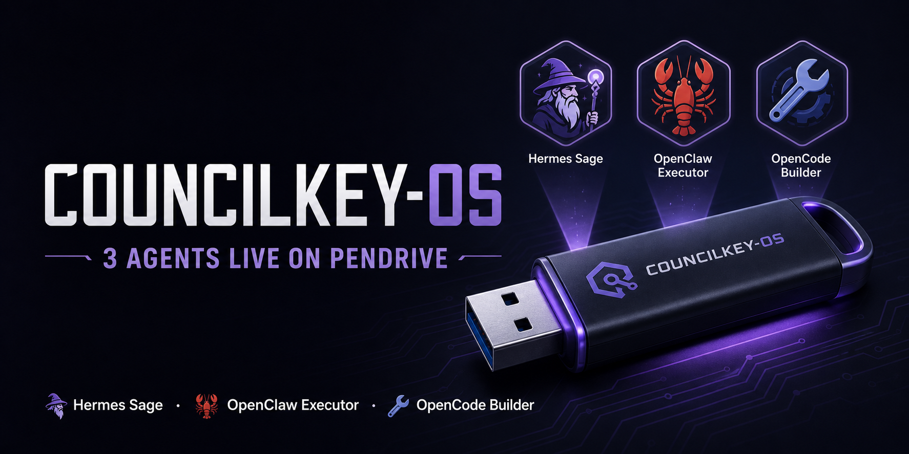 | 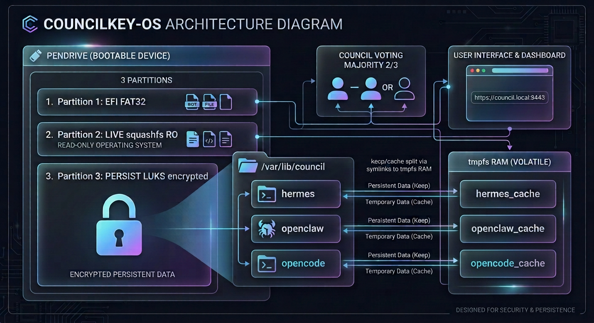 |
| 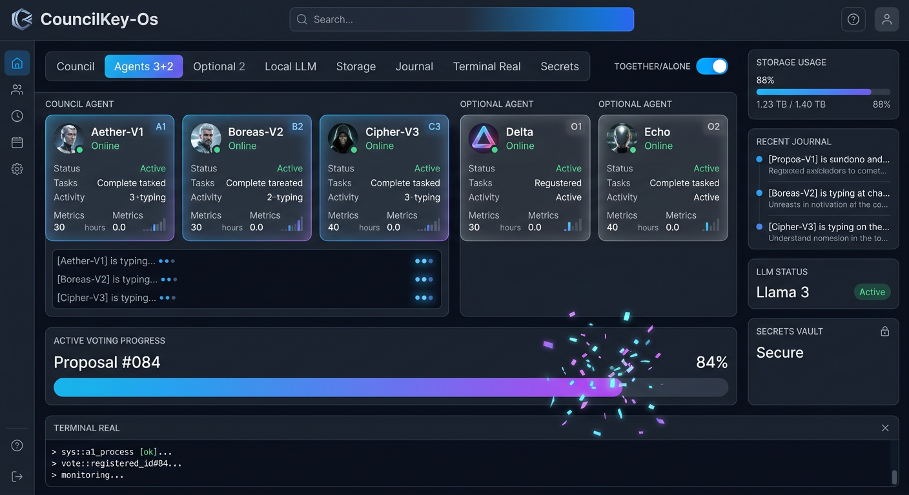 | 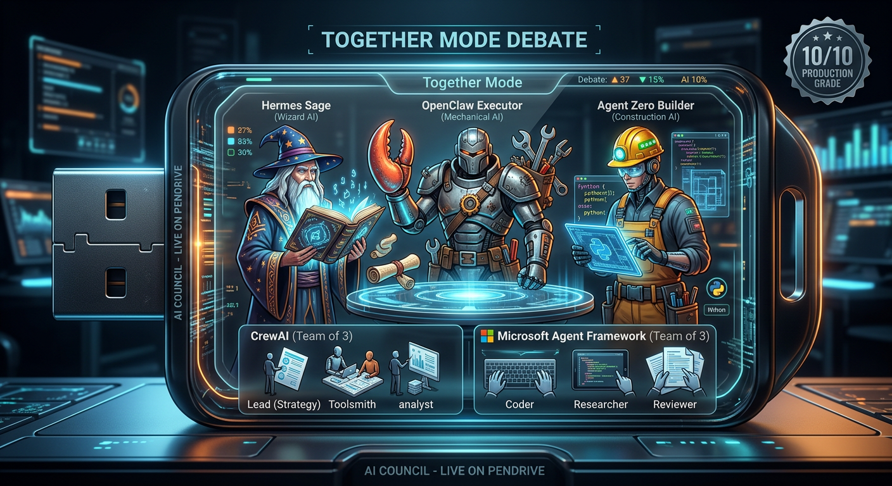 |
| 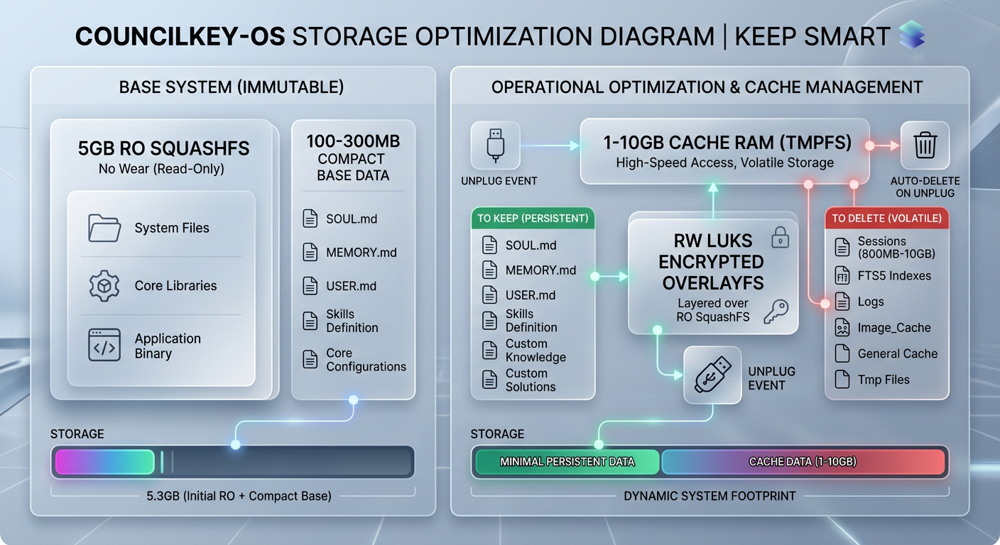 | 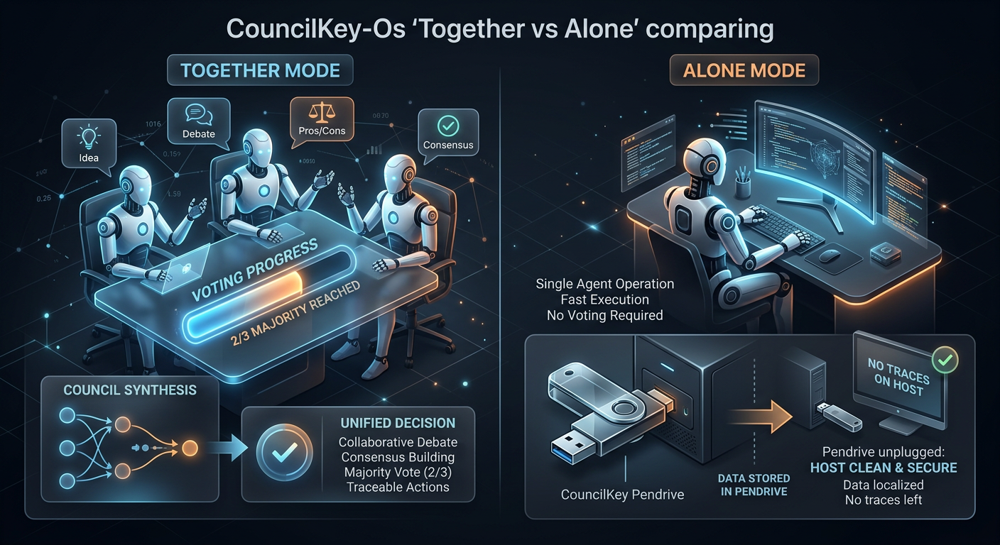 |
| 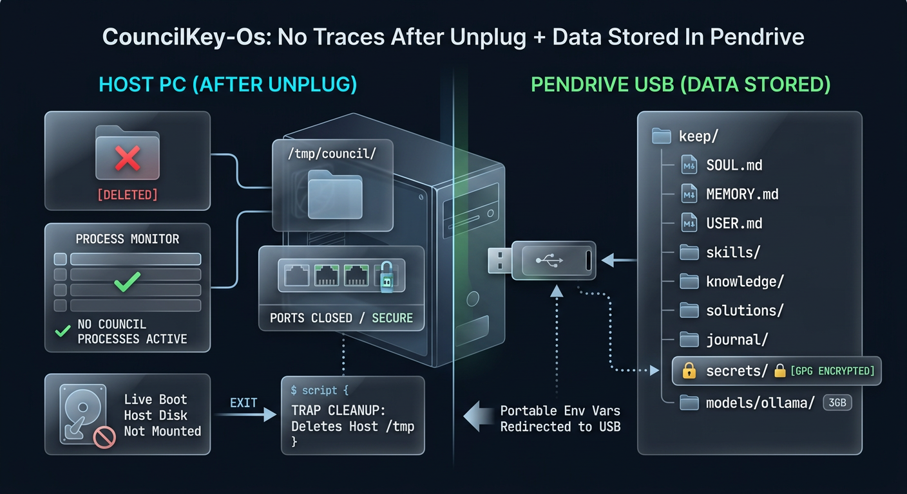 | 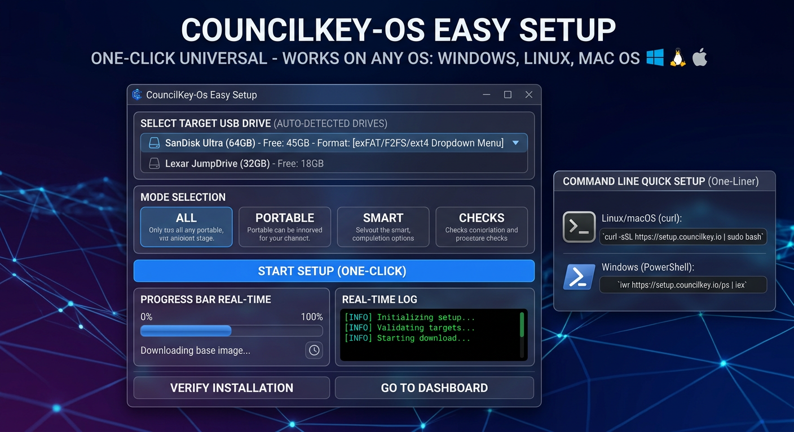 |
| 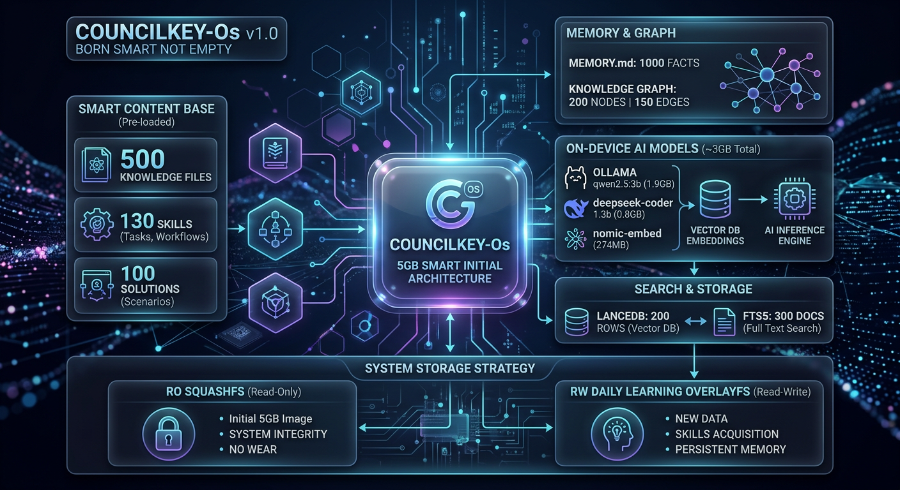 | 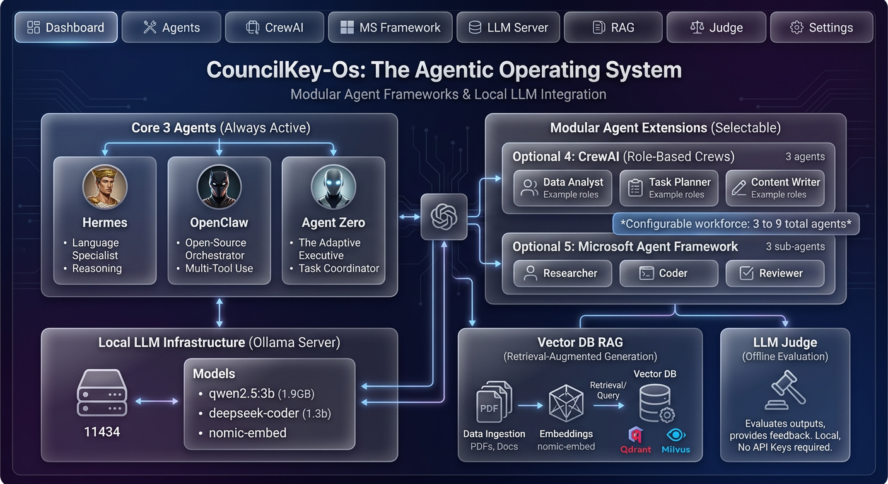 |
| 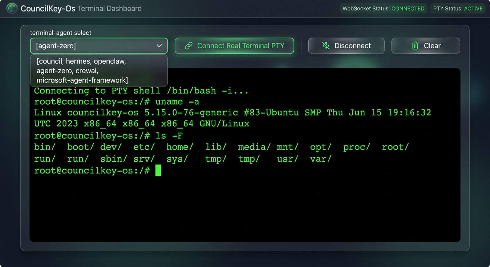 | 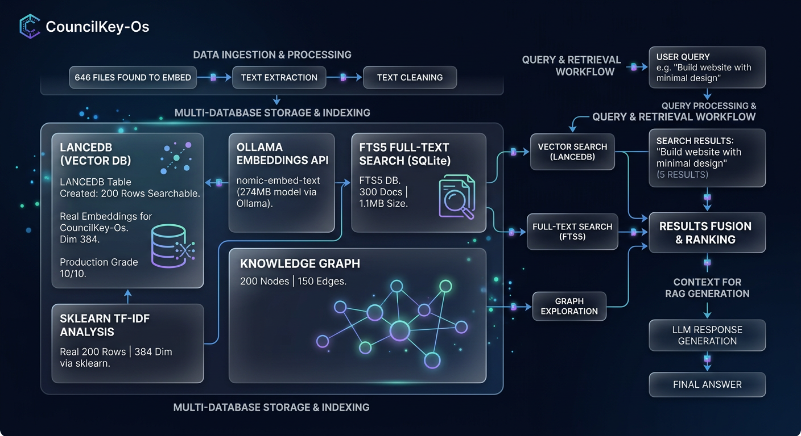 |
| 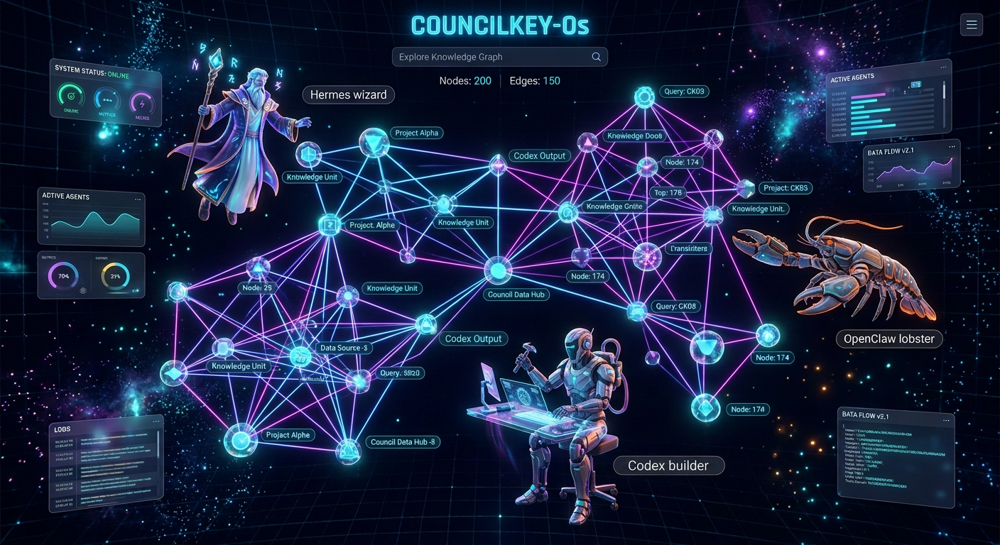 | 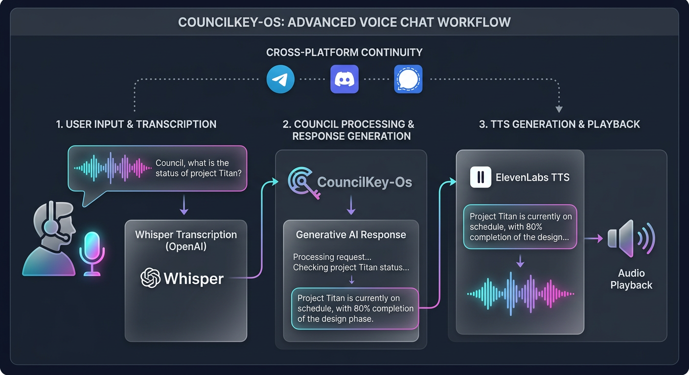 |
| 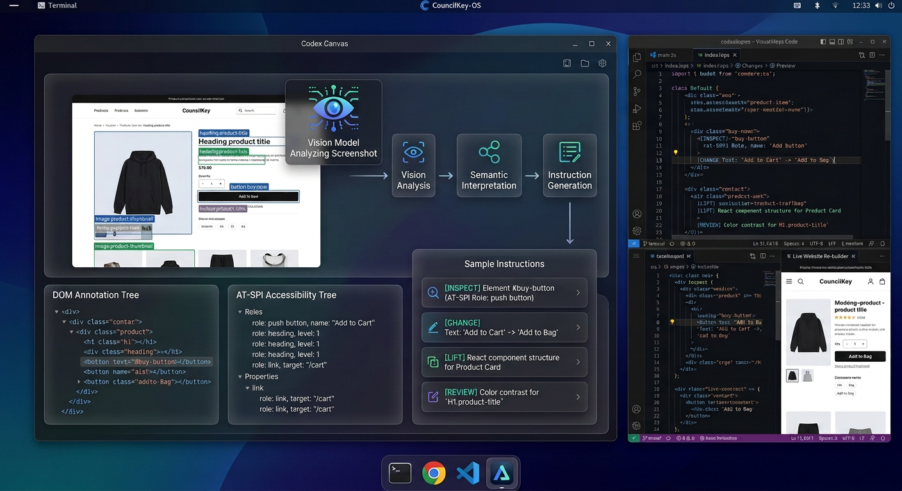 | 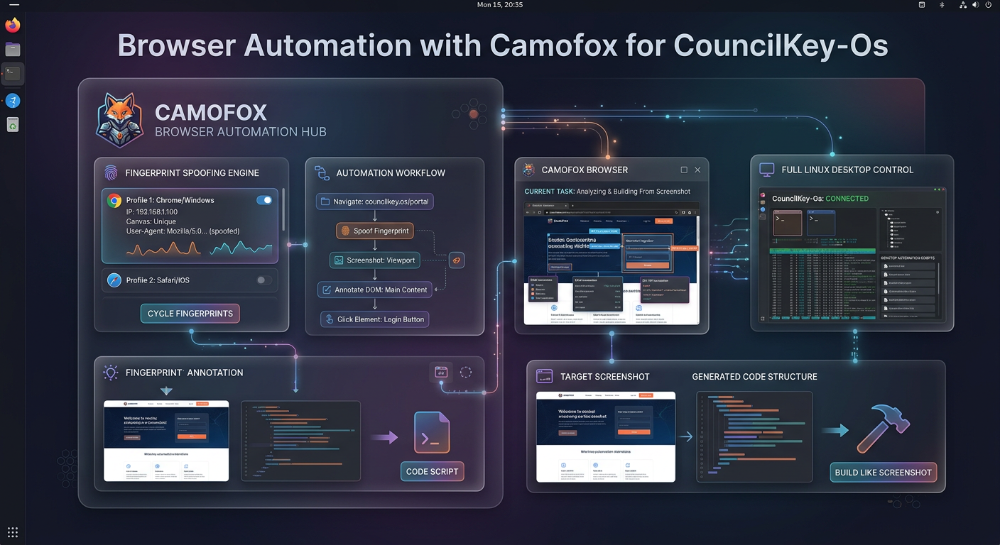 |
| 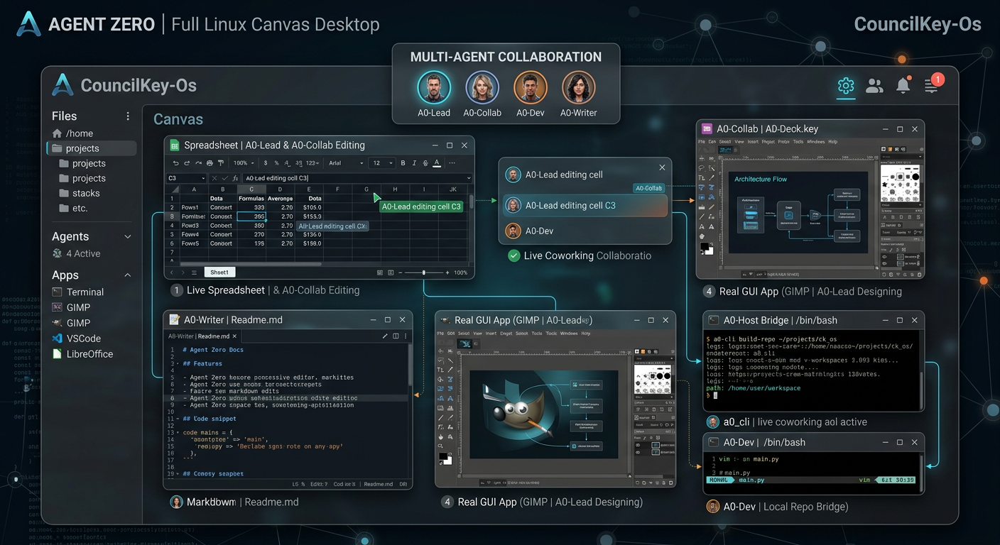 | 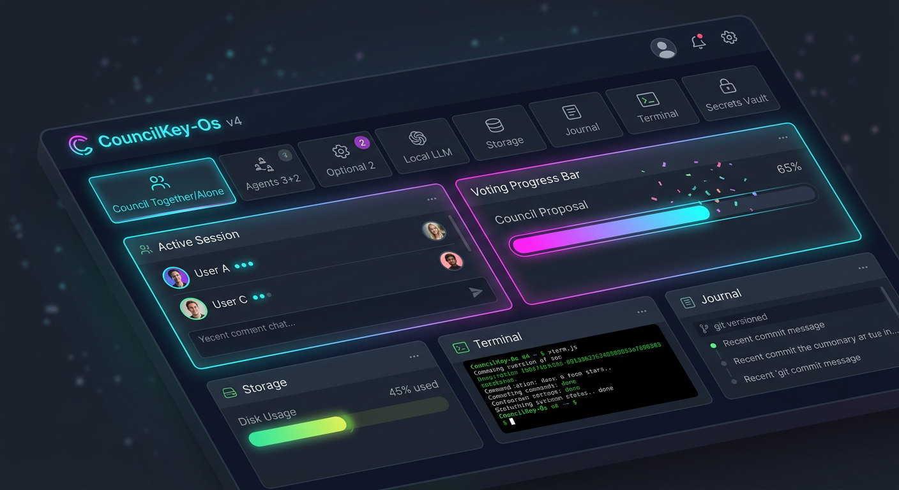 |

---

## Quick start

```bash
# 1. clone
git clone https://github.com/Nikhil009988/CouncilKey-Os.git
cd CouncilKey-Os

# 2. one-command setup - installs CouncilKey-Os AND downloads the 3 agents
#    (Hermes, OpenClaw, Agent Zero) from their official repos automatically
./scripts/setup.sh

# 3. run
./scripts/start.sh                # open http://localhost:8443

# 4. ask
curl -X POST http://localhost:8443/api/council/ask \
  -H 'Content-Type: application/json' \
  -d '{"prompt": "plan a 3-day trip to Goa"}'
```

**Full step-by-step setup & usage instructions (Windows / Linux / macOS, troubleshooting):**
[Complete Setup & Usage Guide](docs/guides/EASY_SETUP_GUIDE.md)

Or as a one-liner (clones to `~/councilkey-os`, runs the full setup):

```bash
curl -fsSL https://raw.githubusercontent.com/Nikhil009988/CouncilKey-Os/arena/019fd1ec-councilkey-os/install.sh | bash
```

**The setup installs a local LLM (Ollama + qwen2.5:3b) — so the 3 council roles genuinely answer, no API keys, no cloud.** The external agents (Hermes, OpenClaw, Agent Zero) are optional interactive tools, installed via each project's official installer (`setup.sh` does it for you; use `--no-agents` to skip). Manage things anytime:

```
councilkey agents status | install | start | verify
councilkey llm status | install | pull
```

Windows: run `scripts\setup.ps1` in PowerShell (installs Ollama via winget automatically), then `scripts\start.bat` or `scripts\start.ps1` to open the dashboard.

Works out of the box: if an agent gateway is offline it answers in mock mode so the pipeline is always testable. Point the gateways at real agents for live operation.

### CLI

```
councilkey serve [--host 0.0.0.0] [--port 8443]
councilkey doctor               # environment health report
councilkey storage [--dry-run]  # audit / optimize storage
councilkey version
```

### systemd (server install)

```bash
sudo ./deploy/install.sh        # installs to /opt/councilkey + enables the service
```

---

## Docs

| Topic | Where |
|---|---|
| API reference (all ~70 endpoints) | [docs/API.md](docs/API.md) |
| Architecture | [docs/architecture/ARCHITECTURE.md](docs/architecture/ARCHITECTURE.md) |
| Security model | [docs/SECURITY.md](docs/SECURITY.md) |
| Build guide (USB / ISO / bootc) | [docs/guides/BUILD.md](docs/guides/BUILD.md) |
| Pendrive guide | [docs/guides/PENDRIVE_GUIDE.md](docs/guides/PENDRIVE_GUIDE.md) |
| Complete setup & usage guide | [docs/guides/EASY_SETUP_GUIDE.md](docs/guides/EASY_SETUP_GUIDE.md) |
| Collaboration modes | [docs/guides/COLLABORATION_MODES.md](docs/guides/COLLABORATION_MODES.md) |
| Change history | [docs/CHANGELOG.md](docs/CHANGELOG.md) |
| Roadmap | [docs/ROADMAP.md](docs/ROADMAP.md) |

---

## How it compares

CouncilKey-Os is not another agent framework — it's a **council wrapper** around three proven agents, focused on portability and privacy.

| | CouncilKey-Os | OpenClaw | Hermes Agent | Agent Zero | CrewAI |
|---|---|---|---|---|---|
| Core idea | 3 agents debate + vote | Multi-channel assistant | Self-improving learning loop | General autonomous agent | Role-based agent teams |
| Multi-agent voting | **Native (built-in)** | Subagents only | Single agent | Single agent | Via workflows |
| Runs from USB, no traces | **Yes (core feature)** | No | No | No | No |
| Offline / local LLM | **Yes (Ollama)** | Yes | Yes | Yes | Yes |
| Setup time | Minutes | Minutes | Minutes | Minutes | Hours |

Everyone is free to use these great open-source projects — CouncilKey-Os sits on top of them and adds the council layer, the voting, and the pendrive-first storage.

---

## Project timeline

| Version | Date | What was added |
|---|---|---|
| v1.0 | 2026-07 | Core council: 3 agents, voting, dashboard, storage split |
| v1.1 | 2026-08-05 | Vision, voice, canvas, browser, CLI, security, scheduler |
| v1.2 | 2026-08-05 | Decomposition, debate, streaming, task queue, audit, search, vault, memory injection, terminal guard |
| v1.3 | 2026-08-05 | One-command setup that downloads the 3 agents automatically + `councilkey agents` CLI |
| v1.4 | 2026-08-05 | Agents really work: local-LLM role agents (Ollama), `llm` + `agents verify` CLI, OpenClaw prebuilt fix, Windows scripts, honest dashboard statuses |

---

## Development

```bash
make test        # pytest (50 tests)
make lint        # ruff
```

Python 3.11+ · MIT License
