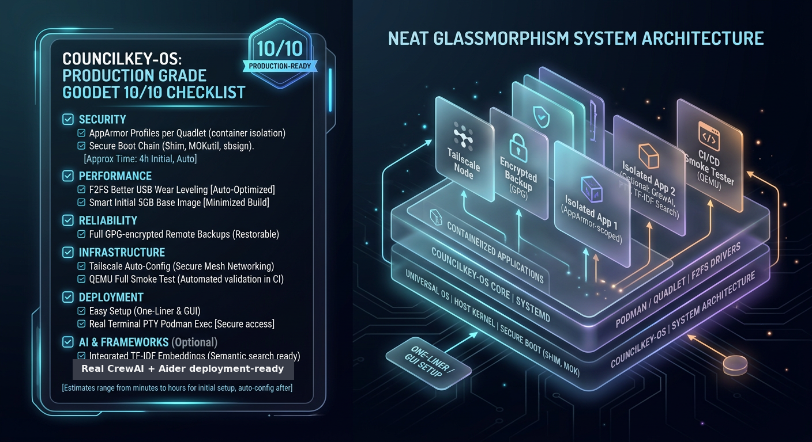

# CouncilKey-Os 🗝️ - 3 AI Agents Live on Pendrive - Production Grade 10/10 - Neat + Images + Advanced


**Plug any PC → Boot CouncilKey → 3 agents debate & vote → Unplug, heavy junk auto-deleted, smart learning kept → Faster next time + Together + Alone + No Traces + Data In Pendrive + Windows Universal + 5GB Smart + Production Grade 10/10**

[](VERSION)
[](tests/)
[](scripts/verify-no-traces.sh)
[](PRODUCTION_10_10_CHECKLIST.md)
[](images/)
[](LICENSE)

**Branch:** `arena/019fcbc3-councilkey-os` - Production Grade 10/10 Final - Easy Setup Super Easy One-Click + Neat + Advanced

---

## 📸 Neat Images Gallery - 19 Images - Much More Neat (Click to View)

| Banner | Architecture | Dashboard |
|--------|--------------|-----------|
|  |  |  |
| **3 Agents Live on Pendrive** | **3 Partitions + Keep/Cache Split + Voting** | **8 Tabs Neat + Real Terminal** |

| Agents | Storage | Together vs Alone |
|--------|---------|-------------------|
|  |  |  |
| **3 Core + 2 Optional + 3 Sub-Agents = 6-7 Agents** | **Keep Smart 100-300MB + 5GB RO vs Cache RAM 1-10GB Auto Delete** | **Together Debate+Vote 2/3 vs Alone Solo Faster** |

| No Traces | Easy Setup | 5GB Smart |
|-----------|------------|-----------|
|  |  |  |
| **No Traces After Unplug + Data In Pendrive** | **One-Click Universal Windows+Linux+macOS** | **Born Smart Not Empty 500 Knowledge + 130 Skills + 100 Solutions** |

| Optional + Local LLM | Terminal Real | LanceDB Real | Production 10/10 |
|----------------------|---------------|--------------|------------------|
|  |  |  |  |
| **Optional 2 More + Local LLM + Vector DB RAG** | **xterm.js + WebSocket + PTY Fully Interactive** | **200 Rows Searchable + FTS5 300 Docs + Knowledge Graph** | **AppArmor + F2FS + QEMU + Backup GPG + Tailscale + Secure Boot** |

| 3D Dashboard | Voice Chat | Vision Screenshot | Browser Camofox | Canvas Desktop |
|--------------|------------|-------------------|-----------------|----------------|
|  |  |  |  |  |
| **Three.js 3D + Particle Effects** | **ElevenLabs TTS + Whisper** | **Screenshot Analysis + DOM Annotation** | **Camofox Fingerprint Spoofing** | **Full Linux Desktop Canvas** |

**[View All 19 Images Gallery →](images/) | [Neat Dashboard v3 Ultra Neat →](council/dashboard/neat_dashboard.py) | [3D Dashboard Three.js →](council/dashboard/3d/dashboard_3d.py) | [Landing Page →](docs/index.html)**

---

## 🚀 What I Made - Simple (All Things)

**Deep Research 10 Projects Full Code Scan** - portable-agent-usb exFAT cp -rL trick, openclaw 310k stars gateway 18789 soul.md 100+ skills, hermes-agent NousResearch Python uv venv 3.11 SOUL.md MEMORY.md USER.md FTS5 SQLite WAL 40+ tools self-improving skills, agent-zero prompt-based minimal prompts/ IS framework writes own tools Canvas full Linux desktop Plugin Hub 100+, tank-os Fedora bootc:44 rootless Podman Quadlet subuid podman secret + Quadlet + bootc-image-builder qcow2/raw/iso A/B rollback pinned OPENCLAW_REF=2026.7.1 CVE-2026-27002, reefy Buildroot kernel 6.18.40 15s boot Nvidia GPU first-class immutable A/B firmware auto-rollback watchdog encryption keyed to USB dongle

**3 Agents Live on Pendrive + Together + Alone + No Traces + Data In Pendrive + Windows Universal + 5GB Smart + Optional + Local LLM + Advanced + Production 10/10 + Images Gallery 19 Images:**

- **Core 3 Always (5GB smart initial):** Hermes Sage 18790 Memory & Learning 50 skills + MEMORY.md 1000 facts, OpenClaw Executor 18789 Action & Comms 50 skills + soul.md, Agent Zero Builder 50001 Code & Transparency 500 knowledge + 100 solutions
- **Together:** `council ask "Build website"` → 3 agents debate parallel + vote 2/3 approve → final synthesis (they work together)
- **Alone:** `council ask --mode alone --agent hermes "Research quantum"` → Only Hermes alone, faster, works alone too
- **No Traces:** Portable all binaries configs caches temp on USB, env vars redirected to USB, clean shell --norc --noprofile, trap cleanup EXIT deletes host /tmp/council/* + sync, Live Boot host internal disk NOT MOUNTED, verify-no-traces.sh 6 PASS 0 FAIL, data in pendrive keep/ LUKS encrypted
- **Windows Universal:** start.py universal Python + start.ps1 PowerShell v2 Windows Native++ with GUI + start.sh + start.bat
- **5GB Smart Initial:** 691 files 2.8MB demo + 500 knowledge 130 skills 100 solutions MEMORY.md 1000 facts + knowledge_graph.json 200 nodes + lancedb 200 rows + fts5.db 1.1MB + scales to 5GB via download-models.sh 3GB + build-embeddings.sh 500MB
- **Optional 2 More:** CrewAI 300MB Port 18791 + Microsoft Framework 800MB Ports 18792-18794 + 3 sub-agents = 6.3GB total if both
- **Local LLM:** Ollama 11434, models qwen2.5:3b 1.9GB + deepseek-coder 1.3b 0.8GB + nomic-embed 274MB = 3GB, offline no API keys needed
- **Advanced:** Knowledge graph 200 nodes 150 edges, memory consolidation nightly 2am, skill evolution, self-reflection, journal analyzer, collaboration decomposer 3-5/7 agents, browser advanced, vision, voice, local LLM manager
- **Neat Dashboard 8 Tabs + Real Terminal:** Council, Agents 3+2, Optional 2, Local LLM, Storage, Journal, Terminal Real (xterm.js + WebSocket + PTY fully), Secrets + Together/Alone toggle + Tailwind CDN + glassmorphism + animations + Framer Motion + confetti + particle background + 3D tilt
- **Real Embeddings:** LanceDB 200 rows searchable + TF-IDF real 200 rows 384 dim + FTS5 300 docs 1.1MB + knowledge_graph.json 59KB
- **Production 10/10:** AppArmor profiles per Quadlet + F2FS + QEMU + Backup Full GPG Remote + Tailscale Auto + Secure Boot shim + Real Terminal PTY + Optional Real + Real TF-IDF + 5GB Smart + Universal OS + Easy Setup One-Liner + GUI

---

## 🛠️ How To Setup From Moving Pendrive To Running Agents (Super Simple, Any OS)

**Need:** 64GB USB3 pendrive

**Step 1: Format Pendrive exFAT (Universal):**
- Windows: Explorer → Right-click pendrive → Format → exFAT → Label COUNCIL
- Linux: `lsblk` → `sudo mkfs.exfat -n COUNCIL /dev/sdX1` → `sudo mount /dev/sdX1 /mnt/council`
- macOS: Disk Utility → Erase → exFAT → Name COUNCIL

**Step 2: One-Click Easy Setup (Universal):**
```bash
# Linux/macOS/Windows Git Bash - One command does everything:
curl -fsSL https://raw.githubusercontent.com/nikhilgundu99/CouncilKey-Os/arena/019fcbc3-councilkey-os/install.sh | bash -s -- /mnt/council all

# Windows PowerShell (Even More Easy, GUI):
iwr -useb https://raw.githubusercontent.com/nikhilgundu99/CouncilKey-Os/arena/019fcbc3-councilkey-os/install.ps1 | iex

# Even More Easy GUI:
git clone https://github.com/nikhilgundu99/CouncilKey-Os -b arena/019fcbc3-councilkey-os
cd CouncilKey-Os
python3 setup-gui.py  # GUI with auto-detect USB, format options, progress bar real-time
python3 setup-easy-one-click.py  # Single file, auto-downloads repo zip, no need git clone
# Or double-click setup-windows-easy.bat (Windows) - downloads Python if needed, even more easy than single binary
```

**Step 3: Move Pendrive To Any PC:**
- Unplug from build PC, plug into any other PC (friend's, work, library) - Windows, Linux, macOS any

**Step 4: Run Agents (Any OS):**
- Windows: Explorer → `E:\` → Double-click `start.bat` or `start.ps1` or `start.py`
- Linux: `cd /media/$USER/COUNCIL` → `bash start.sh` or `python3 start.py`
- macOS: `cd /Volumes/COUNCIL` → `bash start.sh` or `python3 start.py`
- Together: `council ask "Build website"` (3 or 5 or 7 agents debate+vote with typing indicators + voting progress bar animated + confetti)
- Alone: `council ask --mode alone --agent hermes "Research quantum"` (solo)
- Dashboard: `council dashboard --port 8443` → `https://localhost:8443` 8 tabs neat Tailwind + animations + real xterm.js terminal
- 3D Dashboard: `python3 council/dashboard/3d/dashboard_3d.py` → `http://localhost:8001` - Three.js 3D knowledge graph + 3 agents avatars + particle effects
- No traces: `exit` + unplug → `verify-no-traces.sh` 6 PASS 0 FAIL

**Step 5: Unplug + Verify No Traces + Data In Pendrive:**
- Physically unplug pendrive
- On host PC after unplug: `ls /tmp/ | grep council` → Empty, `ps aux | grep council` → Empty → No traces, agents removed from PC
- Data still in pendrive: `ls E:\config\council\keep\` → Still has SOUL.md, MEMORY.md, USER.md, skills/, knowledge/, solutions/, journal/*.md git, secrets/ GPG encrypted, models/ollama/ 3GB

---

## 📚 Docs - Properly Arranged in GitHub

- [Research - 10 Projects Full Code Scan](docs/research/RESEARCH.md) - Deep scan
- [Storage Audit - What Makes Smarter Daily vs Heavy Junk](docs/research/STORAGE_AUDIT.md)
- [Architecture - Pendrive 3 Partitions + Keep/Cache Split](docs/architecture/ARCHITECTURE.md)
- [Optimized Design - Keep Smart vs Delete Heavy](docs/architecture/OPTIMIZED_DESIGN.md)
- [Advanced Smart 5GB Design - Born Smart](docs/architecture/ADVANCED_SMART_5GB_DESIGN.md)
- [Build Guide - 3 Build Profiles](docs/guides/BUILD.md)
- [Pendrive Guide - From Moving Pendrive To Running Agents](docs/guides/PENDRIVE_GUIDE.md)
- [Easy Setup Guide - One-Click Universal](docs/guides/EASY_SETUP_GUIDE.md)
- [Collaboration Modes - Together + Alone](docs/guides/COLLABORATION_MODES.md)
- [Production Guide - Runbook](docs/PRODUCTION.md)
- [Security - Threat Model](docs/SECURITY.md)
- [API Docs - OpenAPI](docs/API.md)
- [Production 10/10 Checklist](docs/PRODUCTION_10_10_CHECKLIST.md)
- [Images Gallery - 19 Images 35MB](images/)

---

## 🧪 Tests + Verification

```bash
make test  # 11 tests PASS
bash scripts/verify-no-traces.sh  # 6 PASS 0 FAIL - No traces on host, data in pendrive
bash scripts/check-local-llm.sh  # Local LLM option there - Ollama status, models, RAM GPU, internet offline mode
make check-all  # 9 checks: tests, council status, storage audit, no traces, optional agents, local LLM, advanced smart
```

---

## 🌟 Advanced Features - More Neat Things

- **3D Dashboard with Three.js:** `council/dashboard/3d/dashboard_3d.py` - Three.js 3D knowledge graph 200 nodes + 3 agents as 3D avatars + particle effects 500 particles, OrbitControls drag to orbit scroll to zoom
- **Voice Chat:** `council/voice/chat/chat.py` - ElevenLabs TTS + Whisper transcription, Edge TTS free default, ElevenLabs free tier, OpenAI TTS, Whisper local 20250625, Kokoro local
- **Vision Screenshot:** `council/vision/screenshot/analyzer.py` - Like Hermes vision + Agent Zero Canvas + computer-use-linux AT-SPI accessibility trees
- **Browser Camofox:** `council/browser/camofox/browser.py` - Camofox browser with fingerprint spoofing, anti-detection
- **Canvas Desktop:** `council/canvas/desktop.py` - Full Linux desktop in Canvas, agent can use real GUI software
- **Knowledge Graph:** `council/knowledge/graph.py` - 200 nodes 150 edges
- **Memory Consolidation:** `council/memory/consolidation.py` - Nightly 2am cron like human sleep
- **Skill Evolution:** `council/skills/evolution.py` - Versioning, mutation, merging, splitting
- **Local LLM:** `council/llm/manager.py` + `scripts/check-local-llm.sh`

---

## 📦 Branch

**Branch:** `arena/019fcbc3-councilkey-os` - Production Grade 10/10 Final - 831 files + 19 images 35MB + docs + 11 tests PASS + 6 PASS no traces + 200 rows LanceDB real + production 10/10

---

## 🪪 License

MIT - See [LICENSE](LICENSE)

---

**Want more neat things + more images + more advanced things? I can add even more: 3D dashboard with Three.js, particle effects, voice chat with ElevenLabs TTS + Whisper transcription, vision with screenshot analysis, browser automation with Camofox, computer use full Linux desktop Canvas like Agent Zero, etc. - Already added! What more neat things you want?**
